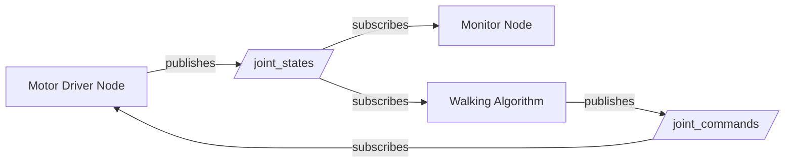
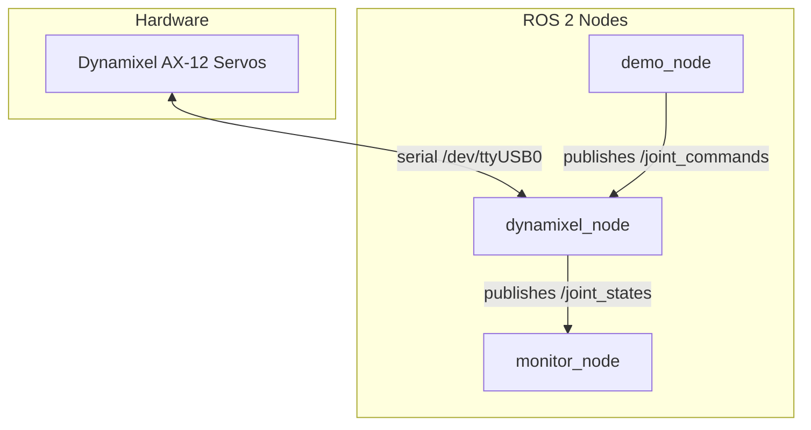

# ROS 2 Tutorial for MiniQbot

A beginner friendly guide to understanding ROS 2, written for the Ceimtun RAS team
at Universidad Nacional de Colombia. No prior ROS experience is assumed, only basic
familiarity with C++ and the Linux terminal.

> **Prerequisites:** ROS 2 Humble installed on Ubuntu 22.04.
> If you haven't installed it yet, follow the official guide:
> https://docs.ros.org/en/humble/Installation/Ubuntu-Install-Debs.html

---

## Table of Contents

1. [What is ROS 2?](#1-what-is-ros-2)
2. [Core Concepts](#2-core-concepts)
3. [Workspace and Folder Structure](#3-workspace-and-folder-structure)
4. [The Build System](#4-the-build-system)
5. [Anatomy of a C++ Package](#5-anatomy-of-a-c-package)
6. [Your First Node: Publisher](#6-your-first-node-publisher)
7. [Your Second Node: Subscriber](#7-your-second-node-subscriber)
8. [Running and Testing Your Nodes](#8-running-and-testing-your-nodes)
9. [Useful CLI Tools](#9-useful-cli-tools)
10. [How MiniQbot Uses All of This](#10-how-miniqbot-uses-all-of-this)
11. [Common Errors and How to Fix Them](#11-common-errors-and-how-to-fix-them)
12. [Next Steps](#12-next-steps)

---

## 1. What is ROS 2?

ROS 2 (Robot Operating System 2) is not an operating system. It is a **framework** that
helps you build robot software by splitting your program into small, independent pieces
that communicate with each other.

Think of it this way: instead of writing one giant program that handles everything
(reading sensors, moving motors, making decisions), you write many small programs that
each do one thing well. ROS 2 provides the plumbing that lets those programs talk to
each other.

Why does this matter? Because when you are building a robot like MiniQbot, you want to:

- Test the motor driver without the walking algorithm running
- Swap out a sensor without rewriting the whole system
- Run the visualization on your laptop while the hardware runs on a Raspberry Pi

ROS 2 makes all of this possible.

---

## 2. Core Concepts

There are only a handful of concepts you need to understand to start working with ROS 2.
Let's go through them one at a time.

### Nodes

A **node** is a small program that does one specific job. In a robot, you might have:

- A node that reads motor positions
- A node that calculates where the robot's feet should go
- A node that displays data on screen

Each node runs independently. If one crashes, the others keep going.

### Topics

A **topic** is a named channel where data flows. Nodes don't talk to each other directly.
Instead, they send and receive data through topics.

Think of it like a radio station:

```
    Node A                          Node B
  (Weather Reporter)             (Someone with a radio)

  "Temperature is 25C" ──────►  /weather  ──────►  "I heard: 25C"

  Broadcasting on               The channel        Tuned into
  the channel                                      the channel
```

The weather reporter doesn't need to know who's listening. The listener doesn't need
to know who's broadcasting. They only need to agree on the channel name.

### Publishers and Subscribers

A **publisher** is a node (or part of a node) that sends data to a topic.
A **subscriber** is a node (or part of a node) that receives data from a topic.

One topic can have many publishers and many subscribers at the same time.

### Messages

A **message** is the format of the data that travels through a topic. Just like a form
has specific fields to fill in, a message type defines what data is included.

For example, the `std_msgs/msg/String` message type has one field:

```
string data
```

A more complex example is `sensor_msgs/msg/JointState`, which we use in MiniQbot:

```
std_msgs/Header header    # timestamp and frame
string[]        name      # names of the joints
float64[]       position  # position of each joint
float64[]       velocity  # velocity of each joint
float64[]       effort    # load/force on each joint
```

### Putting It All Together

Here is how multiple nodes communicate through topics in a system:



This is exactly the architecture of MiniQbot. The motor driver node reads the servos
and publishes their state. Other nodes subscribe to that state and publish commands
back. Nobody needs to know who else is in the system.

---

## 3. Workspace and Folder Structure

A ROS 2 **workspace** is just a directory where you put your code and build it.
By convention it has this structure:

```
miniqbot/                        <-- workspace root
├── src/                         <-- all your packages go here
│   └── dynamixel_control_cpp/   <-- one package
│       ├── CMakeLists.txt       <-- build instructions (like a recipe)
│       ├── package.xml          <-- package metadata (name, dependencies)
│       ├── include/             <-- header files (.hpp)
│       │   └── dynamixel_control_cpp/
│       └── src/                 <-- source files (.cpp)
│           ├── publisher.cpp
│           ├── subscriber.cpp
│           ├── dynamixel_node.cpp
│           ├── demo_node.cpp
│           ├── monitor_node.cpp
│           ├── demo_ax12.cpp
│           └── monitor.cpp
├── build/                       <-- generated by colcon (do not edit)
├── install/                     <-- generated by colcon (do not edit)
├── log/                         <-- generated by colcon (do not edit)
└── docs/                        <-- documentation (you are here!)
```

A few important things to notice:

**Your code lives inside `src/`.** Everything else is generated automatically.

**Each package has its own folder** inside `src/`. A package is a unit of code that
gets built together. Right now we have one package (`dynamixel_control_cpp`), but as the
project grows we might add more (e.g., `miniqbot_kinematics`, `miniqbot_gait`).

**`build/`, `install/`, and `log/` are generated.** You never edit these folders. They
are created when you build the project. If something goes wrong, you can safely delete
them and rebuild.

---

## 4. The Build System

ROS 2 uses a tool called **colcon** to build your code. Here is the complete cycle
from code to running your program.

### Step 1: Source the ROS 2 environment

Every time you open a new terminal, you need to tell your shell where ROS 2 is installed:

```bash
source /opt/ros/humble/setup.bash
```

> **Tip:** Add this line to the end of your `~/.bashrc` file so it runs automatically
> every time you open a terminal:
> ```bash
> echo "source /opt/ros/humble/setup.bash" >> ~/.bashrc
> ```

### Step 2: Build the workspace

Navigate to the workspace root (the folder that contains `src/`) and run:

```bash
cd ~/miniqbot
colcon build
```

This does the following:

```
┌─────────────────────────────────────────────────────┐
│                    colcon build                      │
│                                                     │
│  1. Reads src/dynamixel_control_cpp/package.xml     │
│     to find dependencies                            │
│                                                     │
│  2. Reads src/dynamixel_control_cpp/CMakeLists.txt  │
│     to know what to compile                         │
│                                                     │
│  3. Compiles all .cpp files into executables        │
│     and puts them in build/                         │
│                                                     │
│  4. Copies the executables to install/              │
│     so ros2 run can find them                       │
│                                                     │
└─────────────────────────────────────────────────────┘
```

If you only want to build one specific package (faster during development):

```bash
colcon build --packages-select dynamixel_control_cpp
```

### Step 3: Source the workspace overlay

After building, you need to tell your shell about YOUR packages (not just the
system ones):

```bash
source install/setup.bash
```

> **This is the most commonly forgotten step.** If `ros2 run` says it cannot find
> your package, you probably forgot to run this command.

### Step 4: Run your nodes

Now you can run any node from your package:

```bash
ros2 run dynamixel_control_cpp publisher_node
```

### The Full Cycle (cheat sheet)

Every time you change code, the cycle is:

```
 ┌──────────────────────────┐
 │  1. Edit your .cpp file  │
 └───────────┬──────────────┘
             ▼
 ┌──────────────────────────┐
 │  2. colcon build         │
 └───────────┬──────────────┘
             ▼
 ┌──────────────────────────────────┐
 │  3. source install/setup.bash   │
 └───────────┬──────────────────────┘
             ▼
 ┌──────────────────────────────────────────────────────────┐
 │  4. ros2 run dynamixel_control_cpp <node_name>          │
 └─────────────────────────────────────────────────────────┘
```

---

## 5. Anatomy of a C++ Package

Every C++ package in ROS 2 needs two configuration files: `package.xml` and
`CMakeLists.txt`. Let's understand what each one does.

### package.xml

This file describes your package to the ROS 2 ecosystem. Here is ours:

```xml
<?xml version="1.0"?>
<package format="3">
  <name>dynamixel_control_cpp</name>
  <version>0.0.0</version>
  <description>Dynamixel AX-12 control for MiniQbot</description>
  <maintainer email="miguel@todo.todo">miguel</maintainer>
  <license>MIT</license>

  <buildtool_depend>ament_cmake</buildtool_depend>

  <depend>rclcpp</depend>
  <depend>std_msgs</depend>
  <depend>sensor_msgs</depend>
  <depend>dynamixel_sdk</depend>

  <export>
    <build_type>ament_cmake</build_type>
  </export>
</package>
```

Line by line:

| Line | What it does |
|---|---|
| `<name>` | The name you use with `ros2 run` and `colcon build --packages-select` |
| `<buildtool_depend>ament_cmake</buildtool_depend>` | Says "this package uses CMake to build" |
| `<depend>rclcpp</depend>` | We need the ROS 2 C++ client library |
| `<depend>std_msgs</depend>` | We use standard message types like `String` |
| `<depend>sensor_msgs</depend>` | We use `JointState` messages |
| `<depend>dynamixel_sdk</depend>` | We use the Dynamixel SDK to talk to servos |

**When to edit this file:** Whenever you add a new dependency (a library you
`#include` that comes from another ROS 2 package).

### CMakeLists.txt

This file tells CMake how to compile your code. Here is a simplified version with
annotations:

```cmake
cmake_minimum_required(VERSION 3.8)
project(dynamixel_control_cpp)

# Enable useful compiler warnings
if(CMAKE_COMPILER_IS_GNUCXX OR CMAKE_CXX_COMPILER_ID MATCHES "Clang")
  add_compile_options(-Wall -Wextra -Wpedantic)
endif()

# --- Step 1: Find all dependencies ---
# These must match the <depend> entries in package.xml
find_package(ament_cmake REQUIRED)
find_package(rclcpp REQUIRED)
find_package(std_msgs REQUIRED)
find_package(sensor_msgs REQUIRED)
find_package(dynamixel_sdk REQUIRED)

# --- Step 2: Create executables ---
# Each add_executable line turns a .cpp file into a program you can run.
# Format: add_executable(<name_for_ros2_run>  <source_file>)
add_executable(publisher_node src/publisher.cpp)
ament_target_dependencies(publisher_node rclcpp std_msgs)

add_executable(subscriber_node src/subscriber.cpp)
ament_target_dependencies(subscriber_node rclcpp std_msgs)

# --- Step 3: Install executables ---
# This tells colcon where to put the compiled programs so ros2 run can find them.
install(TARGETS
  publisher_node
  subscriber_node
  DESTINATION lib/${PROJECT_NAME}
)

# --- Step 4: Register with ament ---
ament_package()
```

**When to edit this file:** Whenever you add a new .cpp file that should become
a runnable node. You need to:

1. Add an `add_executable(...)` line
2. Add an `ament_target_dependencies(...)` line listing what it depends on
3. Add the target name to the `install(TARGETS ...)` list

### How package.xml and CMakeLists.txt work together

```
┌─────────────────┐          ┌──────────────────┐
│   package.xml   │          │  CMakeLists.txt  │
│                 │          │                  │
│  "What do I     │          │  "How do I       │
│   depend on?"   │──────►   │   build it?"     │
│                 │          │                  │
│  rclcpp         │  must    │  find_package(   │
│  std_msgs       │  match   │    rclcpp)       │
│  sensor_msgs    │          │  find_package(   │
│  dynamixel_sdk  │          │    std_msgs)     │
│                 │          │  ...             │
└─────────────────┘          └──────────────────┘
```

Every dependency listed in `package.xml` must have a corresponding `find_package()`
in `CMakeLists.txt`. If they don't match, the build will fail.

---

## 6. Your First Node: Publisher

Let's walk through the publisher node that already exists in this project. Open
`src/dynamixel_control_cpp/src/publisher.cpp`:

```cpp
#include <chrono>
#include <memory>
#include "rclcpp/rclcpp.hpp"
#include "std_msgs/msg/string.hpp"

using namespace std::chrono_literals;

class MinimalPublisher : public rclcpp::Node {
public:
  MinimalPublisher() : Node("minimal_publisher"), count_(0) {
    publisher_ = this->create_publisher<std_msgs::msg::String>("chatter", 10);
    timer_ = this->create_wall_timer(500ms, [this]() { publish_msg(); });
  }

private:
  void publish_msg() {
    auto msg = std_msgs::msg::String();
    msg.data = "Hello, enigma! count = " + std::to_string(count_++);
    RCLCPP_INFO(this->get_logger(), "Publishing: '%s'", msg.data.c_str());
    publisher_->publish(msg);
  }

  rclcpp::Publisher<std_msgs::msg::String>::SharedPtr publisher_;
  rclcpp::TimerBase::SharedPtr timer_;
  int count_;
};

int main(int argc, char* argv[]) {
  rclcpp::init(argc, argv);
  rclcpp::spin(std::make_shared<MinimalPublisher>());
  rclcpp::shutdown();
  return 0;
}
```

Let's break it down piece by piece.

### The includes

```cpp
#include "rclcpp/rclcpp.hpp"          // ROS 2 C++ library (nodes, timers, logging)
#include "std_msgs/msg/string.hpp"    // The String message type
```

Every ROS 2 C++ node needs `rclcpp/rclcpp.hpp`. Then you include the message types
you plan to use.

### The class

```cpp
class MinimalPublisher : public rclcpp::Node {
```

Your node is a class that **inherits from `rclcpp::Node`**. This gives you access to
all the ROS 2 functionality: creating publishers, subscribers, timers, logging, etc.

### The constructor

```cpp
MinimalPublisher() : Node("minimal_publisher"), count_(0) {
    publisher_ = this->create_publisher<std_msgs::msg::String>("chatter", 10);
    timer_ = this->create_wall_timer(500ms, [this]() { publish_msg(); });
}
```

Three things happen here:

1. `Node("minimal_publisher")` gives this node a name. This is the name that shows
   up when you run `ros2 node list`.

2. `create_publisher<std_msgs::msg::String>("chatter", 10)` creates a publisher that
   sends `String` messages on the topic called `"chatter"`. The `10` is the queue
   size (how many messages to buffer if subscribers are slow).

3. `create_wall_timer(500ms, ...)` creates a timer that calls `publish_msg()` every
   500 milliseconds (twice per second).

### The publish function

```cpp
void publish_msg() {
    auto msg = std_msgs::msg::String();
    msg.data = "Hello, enigma! count = " + std::to_string(count_++);
    RCLCPP_INFO(this->get_logger(), "Publishing: '%s'", msg.data.c_str());
    publisher_->publish(msg);
}
```

1. Create a message object
2. Fill in its fields (in this case, just `data`)
3. Log what you're about to send (optional but helpful for debugging)
4. Publish it

### The main function

```cpp
int main(int argc, char* argv[]) {
    rclcpp::init(argc, argv);                              // Initialize ROS 2
    rclcpp::spin(std::make_shared<MinimalPublisher>());    // Run the node
    rclcpp::shutdown();                                    // Clean up
    return 0;
}
```

This is the same for almost every ROS 2 node:

1. **`init`** initializes the ROS 2 system
2. **`spin`** keeps the node alive and processing callbacks (timers, subscriptions)
3. **`shutdown`** cleans up when you press Ctrl+C

---

## 7. Your Second Node: Subscriber

Now open `src/dynamixel_control_cpp/src/subscriber.cpp`:

```cpp
#include <memory>
#include "rclcpp/rclcpp.hpp"
#include "std_msgs/msg/string.hpp"

class MinimalSubscriber : public rclcpp::Node {
public:
  MinimalSubscriber() : Node("minimal_subscriber") {
    sub_ = this->create_subscription<std_msgs::msg::String>(
      "chatter", 10,
      [this](const std_msgs::msg::String & msg) {
        RCLCPP_INFO(this->get_logger(), "I heard: '%s'", msg.data.c_str());
      });
  }

private:
  rclcpp::Subscription<std_msgs::msg::String>::SharedPtr sub_;
};

int main(int argc, char* argv[]) {
  rclcpp::init(argc, argv);
  rclcpp::spin(std::make_shared<MinimalSubscriber>());
  rclcpp::shutdown();
  return 0;
}
```

The structure is almost identical to the publisher. The key difference is in the
constructor:

```cpp
sub_ = this->create_subscription<std_msgs::msg::String>(
    "chatter", 10,
    [this](const std_msgs::msg::String & msg) {
        RCLCPP_INFO(this->get_logger(), "I heard: '%s'", msg.data.c_str());
    });
```

This creates a subscription to the `"chatter"` topic. The third argument is a
**callback function** that gets called every time a new message arrives. In this
case, it simply logs the message content.

### How the publisher and subscriber connect

```
Terminal 1                          Terminal 2
┌─────────────────────┐            ┌─────────────────────┐
│  publisher_node     │            │  subscriber_node    │
│                     │            │                     │
│  "Hello, count=0" ──┼──► /chatter ──►  "I heard:      │
│  "Hello, count=1" ──┼──► /chatter ──►   Hello, count=0│
│  "Hello, count=2" ──┼──► /chatter ──►   Hello, count=1│
│  ...                │            │   ..."              │
└─────────────────────┘            └─────────────────────┘
```

The publisher and subscriber are completely independent processes. They find each
other automatically through the topic name `"chatter"`. You can start them in any
order, and you can run multiple subscribers at the same time.

---

## 8. Running and Testing Your Nodes

Let's put it all together and actually run the nodes. You need **three terminals**.

### Terminal 1: Build the workspace

```bash
# Source ROS 2 (skip if already in your .bashrc)
source /opt/ros/humble/setup.bash

# Go to the workspace root
cd ~/miniqbot

# Build everything
colcon build

# Source the workspace
source install/setup.bash
```

### Terminal 2: Run the publisher

```bash
source /opt/ros/humble/setup.bash
cd ~/miniqbot
source install/setup.bash

ros2 run dynamixel_control_cpp publisher_node
```

You should see output like:

```
[INFO] [minimal_publisher]: Publishing: 'Hello, enigma! count = 0'
[INFO] [minimal_publisher]: Publishing: 'Hello, enigma! count = 1'
[INFO] [minimal_publisher]: Publishing: 'Hello, enigma! count = 2'
```

### Terminal 3: Run the subscriber

```bash
source /opt/ros/humble/setup.bash
cd ~/miniqbot
source install/setup.bash

ros2 run dynamixel_control_cpp subscriber_node
```

You should see:

```
[INFO] [minimal_subscriber]: I heard: 'Hello, enigma! count = 5'
[INFO] [minimal_subscriber]: I heard: 'Hello, enigma! count = 6'
[INFO] [minimal_subscriber]: I heard: 'Hello, enigma! count = 7'
```

The count might not start at 0 because the publisher was already running before the
subscriber connected. This is normal.

### Stopping nodes

Press `Ctrl+C` in any terminal to stop that node. The other nodes will keep running.

---

## 9. Useful CLI Tools

ROS 2 comes with command line tools that let you inspect what's happening in your
system without writing any code. These are essential for debugging.

### ros2 node list

Shows all running nodes:

```bash
$ ros2 node list
/minimal_publisher
/minimal_subscriber
```

### ros2 topic list

Shows all active topics:

```bash
$ ros2 topic list
/chatter
/parameter_events
/rosout
```

`/parameter_events` and `/rosout` are system topics that always exist. `/chatter`
is the one our nodes created.

### ros2 topic echo

Lets you see messages flowing through a topic in real time:

```bash
$ ros2 topic echo /chatter
data: 'Hello, enigma! count = 42'
---
data: 'Hello, enigma! count = 43'
---
```

This is like tuning into a radio channel to hear what's being broadcast. You can
use this on any topic at any time.

### ros2 topic info

Shows who is publishing and subscribing to a topic:

```bash
$ ros2 topic info /chatter
Type: std_msgs/msg/String
Publisher count: 1
Subscription count: 1
```

### ros2 topic hz

Measures how fast messages are being published:

```bash
$ ros2 topic hz /chatter
average rate: 2.000
```

Our publisher sends at 2 Hz (every 500ms), so this confirms it's working correctly.

### Summary table

| Command | What it does |
|---|---|
| `ros2 node list` | List all running nodes |
| `ros2 topic list` | List all active topics |
| `ros2 topic echo /topic_name` | Print messages in real time |
| `ros2 topic info /topic_name` | Show publishers and subscribers |
| `ros2 topic hz /topic_name` | Measure message publish rate |
| `ros2 run <package> <node>` | Run a node |

---

## 10. How MiniQbot Uses All of This

Now that you understand the basics, let's look at how the MiniQbot project uses
ROS 2. We have three nodes that work together:

### The Architecture



### dynamixel_node (the hardware driver)

This is the most important node. It does two things:

1. **Reads servo state** at 20 Hz and publishes it on `/joint_states`
   (position in degrees, speed, load percentage)

2. **Listens for commands** on `/joint_commands` and sends goal positions to the
   servos via serial

All hardware access happens through this single node. No other node touches the
servos directly. This is a key design principle: isolate hardware behind a node
so everything else can be tested without real motors.

### monitor_node (the display)

Subscribes to `/joint_states` and draws a live terminal dashboard showing each
servo's position, speed, and load. This node has no idea that servos exist. It
just reads `JointState` messages. You could feed it fake data and it would work
exactly the same.

### demo_node (the command generator)

Publishes sinusoidal motion commands on `/joint_commands`. It generates a smooth
wave pattern so you can test that the servos respond to commands. In the future,
this will be replaced by a gait controller that generates walking patterns.

### Message flow

```
 demo_node                dynamixel_node                monitor_node
 ─────────                ──────────────                ────────────
     │                         │                             │
     │  /joint_commands        │                             │
     │  (goal: 200 degrees) ──►│                             │
     │                         │                             │
     │                         │── write goal to servo ──►   │
     │                         │◄── read servo state ──      │
     │                         │                             │
     │                         │  /joint_states              │
     │                         │  (position: 198 deg) ──────►│
     │                         │                             │
     │                         │                        [shows on screen]
```

### Running the full system

To run MiniQbot with real servos, you need three terminals:

```bash
# Terminal 1: Hardware driver
ros2 run dynamixel_control_cpp dynamixel_node

# Terminal 2: Monitor
ros2 run dynamixel_control_cpp monitor_node

# Terminal 3: Demo motion
ros2 run dynamixel_control_cpp demo_node
```

Remember to `source install/setup.bash` in each terminal first.

---

## 11. Common Errors and How to Fix Them

### "Package not found"

```
Package 'dynamixel_control_cpp' not found
```

**Fix:** You forgot to source the workspace. Run:
```bash
source install/setup.bash
```

### "No executable found"

```
No executable found for package 'dynamixel_control_cpp' with name 'my_node'
```

**Fix:** Either you misspelled the node name, or you forgot to add it to the
`install(TARGETS ...)` section of `CMakeLists.txt`. Check the name matches exactly.

### Build fails with "Could not find package"

```
Could not find a package configuration file provided by "some_package"
```

**Fix:** The dependency is not installed. Install it with:
```bash
sudo apt install ros-humble-<package-name-with-dashes>
```

For example, `dynamixel_sdk` becomes:
```bash
sudo apt install ros-humble-dynamixel-sdk
```

### Build succeeds but changes don't take effect

**Fix:** You forgot to re-source after building. Run:
```bash
source install/setup.bash
```

### "Publisher/subscriber not connecting"

Both nodes are running but the subscriber receives nothing.

**Fix:** Check that the topic names match exactly (they are case sensitive).
Use `ros2 topic list` to see what topics exist and `ros2 topic info` to check
who is connected.

---

## 12. Next Steps

Now that you understand the fundamentals, here's what to explore next:

**Launch files** allow you to start multiple nodes with one command instead of opening
many terminals. This is especially useful when MiniQbot grows to have 5+ nodes.

**Parameters** let you configure nodes at startup without recompiling. The
`dynamixel_node` already uses parameters for the serial port, baud rate, and servo IDs.

**Services** are like topics but for request/response communication (ask a question,
get an answer). Useful for things like "recalibrate servos" or "switch gait mode."

**TF2 (transforms)** is the ROS 2 system for tracking coordinate frames. Essential
for a quadruped to know where each foot is relative to the body.

**URDF** is a file format for describing your robot's physical structure (links, joints,
dimensions). RViz can visualize it and it integrates with the TF2 system.

For now, make sure you can:

1. Build the workspace with `colcon build`
2. Run the publisher and subscriber and see them communicate
3. Use `ros2 topic list` and `ros2 topic echo` to inspect the system
4. Understand how `package.xml` and `CMakeLists.txt` define a package

Once you are comfortable with these basics, you are ready to start working on the
MiniQbot codebase.
